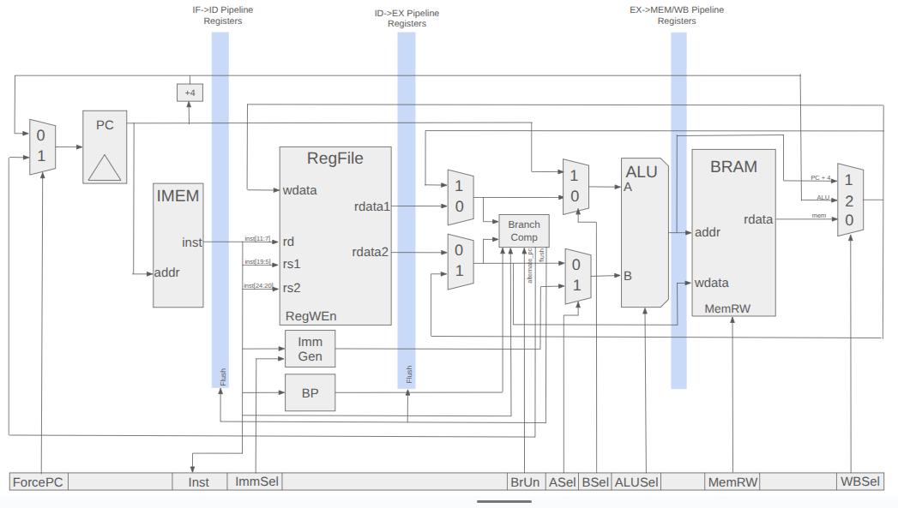

# RISC-V with Quantum ISA Extension

This is a RISC-V processor project with an extended instruction set for superconducting qubit control. This is a personal project in order to learn Verilog and apply my knowledge of Quantum Control Electronics to a project.

## Microarchitecture

This RISC-V processor has four pipelined stages:

1. Instruction Fetch - Instructions are retreived from IMEM
2. Instruction Decode - Instructions are decoded, registers are accessed, branch prediction is made
3. Execution - Branch comparison is made and compared to branch prediction, registers are used in ALU operation
4. MEM/WB - Memory is read/written to, and the writeback value is sent to the register file

The reasons for this style of pipeline are as follows:
- Pipeline between address and memory read to make memory read combinational for instant writeback. This is synthesizable on Xilinx FPGAs, and is a way to reduce the memory latency without introducing more data hazards in a five stage pipelined processor.
- Data forwarding is used to the EX stage from MEM/WB. If the MEM/WB stage is writing to a register that is being used in EX, there is a mux that will forward the data into the ALU/Branch comp module. 
- Having the branch predictor in the decode stage will make the penalty for jump instructions only 1 cycle, and the penalty for mispredicted branches 2 cycles instead of the typical 3 cycles in a 5-stage pipeline. 

## Tesbenches

I am going to use Cocotb with a verilator backend to test the processor.

## Block Diagram

The block diagram for the RISC-V core is shown below.

The other half of the architecture is the pulse scheduler, which uses a faster clock. The two transfer data using an asynchronous FIFO for CDC.

## Pulse Scheduler

The pulse scheduler is the component of the architecture that takes care of triggering pulses when they are loaded via an instruction from the RISC-V core. When a quantum pulse instruction is executed in the RISC-V core, the information will be submitted to an asynchronous FIFO, which will be accessed by the pulse scheduler. When the pulse scheduler gets the address and start time of the pulse, it will retrieve the parameters and load it into the pulse FIFO. The pulse FIFO will decrement the start time of every pulse, and will pop the first pulse when its delay is zero.

Once the pulse is popped from the FIFO, it will be sent to the pulse engine, to send data to the RFSoC's DAC for pulse generation.

## Pulse Memory

This is the format of pulse descriptor words in memory. These words will be loaded in when a program is compiled and instructions/memory is loaded into the design.

| **Field**  | **Bit Range (msb\:lsb)** | **Width (bits)** | **Description**                                                                |
| ---------- | ------------------------ | ---------------- | ------------------------------------------------------------------------------ |
| `freq`     | **31 : 0**               | 32 bits          | Frequency |
| `phase`    | **47 : 32**              | 16 bits          | Initial phase offset |
| `amp`      | **61 : 48**              | 14 bits (signed) | Amplitude |
| *spare*    | **63 : 62**              | 2 bits           | Reserved / alignment. |
| `t_len`    | **79 : 64**             | 16 bits           | Envelope length |
| `env_addr` | **95 : 80**            | 16 bits            | Address of Envelope in Memory |
| *reserved* | **127 : 96**            | 32 bits           | Future use (flags, CRC, channel ID, etc.).                                     |

## Quantum ISA Extension Summary

These are the quantum instructions that are supported in the RISC-V processor. 

| Instruction                 | Format                                                     | Purpose                                                                                                         | Result                   | Notes                                                       |
| --------------------------- | ---------------------------------------------------------- | --------------------------------------------------------------------------------------------------------------- | ------------------------ | ----------------------------------------------------------- |
| **`QPULSE rd, rs1, imm12`** | *I-type* (`opcode 0x0B`, `funct3 000`)                     | Push descriptor index **`rs1`** to the launch FIFO; schedule it **`imm12`** cycles after the current timer. | `rd` unused → write `x0` | `imm12 = 0` ⇒ play *now*.                                   |
| **`QDELAY imm12`**          | *I-type* (`opcode 0x0B`, `funct3 001`)                     | Busy-wait inside the CPU for `imm12` scheduler cycles.                                                          | none                     | Generates **no FIFO traffic**.                              |
| **`QWAIT_BUSY`**            | *I-type* (`opcode 0x0B`, `funct3 010`, all other fields 0) | Stall until the scheduler FIFO is empty.                                                                        | none                     | Acts like a fence.                                          |
| **`QGETT rd`**              | *I-type* (`opcode 0x0B`, `funct3 011`, imm=0, `rs1`=0)     | Read the **32 bits** of the scheduler time-counter into `rd`.                                               | counter value            | Pipeline stalls until value is returned.                    |
| **`QSETT rs1`**             | *I-type* (`opcode 0x0B`, `funct3 100`, imm=0, `rd`=0)      | Overwrite the scheduler time-counter with **`rs1`**.                                                            | none                     | Stalls until acknowledge; use to reset or load a base time. |

| Bits 31-25  | 24-20      | 19-15     | 14-12   | 11-7     | 6-0         | Operation                                          |
| ----------- | ---------- | --------- | ------- | -------- | ----------- | -------------------------------------------------- |
| `imm[11:5]` | `imm[4:0]` | **`rs1`** | **000** | **`rd`** | **0001011** | **`QPULSE`** – enqueue `rs1` with δ = `imm[11:0]`. |
| `imm[11:5]` | `imm[4:0]` | `00000`   | **001** | `00000`  | **0001011** | **`QDELAY`** – Wait `imm[11:0]` cycles.            |
| `0000000`   | `00000`    | `00000`   | **010** | `00000`  | **0001011** | **`QWAIT_BUSY`** – block until FIFO empty.         |
| `0000000`   | `00000`    | `00000`   | **011** | **`rd`** | **0001011** | **`QGETT`** – read counter into `rd`.              |
| `0000000`   | **`rs1`**  | `00000`   | **100** | `00000`  | **0001011** | **`QSETT`** – write counter from `rs1`.            |

## To-Do:

1. Implement the pulse engine
2. Implement quantum op decoding in the RISC-V core